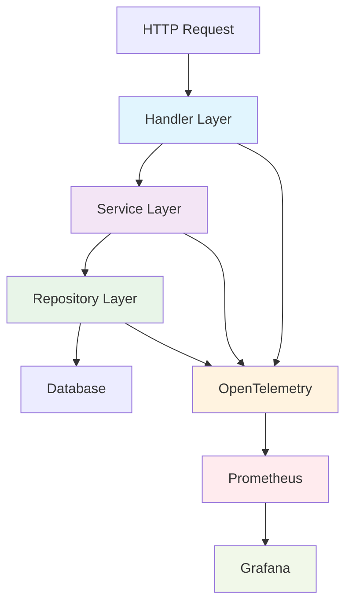

# 📊 Observabilidade Completa - OpenTelemetry + Prometheus + Grafana

## 🎯 Visão Geral

Esta implementação fornece **observabilidade completa por camada** para aplicações Go, permitindo monitoramento granular de performance, erros, timeouts e uso. Utilizamos OpenTelemetry para coleta de métricas, Prometheus para armazenamento e Grafana para visualização.

### ✨ Principais Funcionalidades

- 📈 **Métricas por Camada**: Handler, Service, Repository
- ⏱️ **Detecção de Timeouts**: Operações que excedem limites de tempo
- 🐌 **Operações Lentas**: Thresholds configuráveis por camada
- 🚨 **Monitoring de Erros**: Taxa de erro por operação
- 💰 **Business Metrics**: Métricas orientadas a negócio
- 🔍 **Troubleshooting Rápido**: Dashboards para identificar gargalos

---

## 🏗️ Arquitetura



### 🔧 Stack Tecnológica

| Componente | Tecnologia | Porta | Descrição |
|------------|------------|-------|-----------|
| **Aplicação** | Go + Echo | 8000 | API principal |
| **Métricas** | OpenTelemetry | 2112 | Coleta de métricas |
| **Storage** | Prometheus | 9090 | Armazenamento de métricas |
| **Visualização** | Grafana | 3000 | Dashboards e alertas |

---

## 📋 Métricas Disponíveis

### 🌐 HTTP Metrics

| Métrica | Tipo | Descrição | Labels |
|---------|------|-----------|--------|
| `http_requests_total` | Counter | Total de requisições HTTP | `usecase`, `method`, `endpoint`, `status_code` |
| `http_request_duration_seconds` | Histogram | Duração das requisições HTTP | `usecase`, `method`, `endpoint`, `status_code` |
| `http_errors_total` | Counter | Total de erros HTTP (≥400) | `usecase`, `method`, `endpoint`, `status_code` |

**Exemplo:**
```promql
http_requests_total{usecase="meuexemplo", method="GET", endpoint="/api/meuexemplo", status_code="200"}
```

### 🏗️ Layer Metrics (PRINCIPAL DIFERENCIAL)

| Métrica | Tipo | Descrição | Threshold | Labels |
|---------|------|-----------|-----------|--------|
| `handler_duration_seconds` | Histogram | Tempo na camada handler | >1s = lento | `usecase`, `operation`, `layer`, `success` |
| `service_duration_seconds` | Histogram | Tempo na camada service | >500ms = lento | `usecase`, `operation`, `layer`, `success` |
| `repository_duration_seconds` | Histogram | Tempo na camada repository | >200ms = lento | `usecase`, `operation`, `layer`, `success` |

**Exemplo:**
```promql
handler_duration_seconds{usecase="meuexemplo", operation="get_by_id", layer="handler", success="true"}
```

### ⏰ Timeout & Performance Metrics

| Métrica | Tipo | Descrição | Labels |
|---------|------|-----------|--------|
| `timeout_operations_total` | Counter | Operações que deram timeout | `usecase`, `operation`, `error_type` |
| `canceled_operations_total` | Counter | Operações canceladas | `usecase`, `operation`, `error_type` |
| `slow_operations_total` | Counter | Operações acima do threshold | `usecase`, `operation`, `layer` |

### 🗄️ Database Metrics

| Métrica | Tipo | Descrição | Labels |
|---------|------|-----------|--------|
| `db_connections_active` | UpDownCounter | Conexões ativas | `usecase` |
| `db_query_duration_seconds` | Histogram | Duração das queries | `usecase`, `operation`, `table` |
| `db_queries_total` | Counter | Total de queries | `usecase`, `operation`, `table` |
| `db_query_errors_total` | Counter | Erros em queries | `usecase`, `operation`, `table` |

### 💼 Business Metrics

| Métrica | Tipo | Descrição | Labels |
|---------|------|-----------|--------|
| `business_operations_total` | Counter | Operações de negócio | `usecase`, `operation`, `success` |
| `business_operation_duration_seconds` | Histogram | Duração das operações | `usecase`, `operation`, `success` |

### 🖥️ System Metrics

| Métrica | Tipo | Descrição | Labels |
|---------|------|-----------|--------|
| `memory_usage_bytes` | UpDownCounter | Uso de memória | `type` |
| `goroutines_active` | UpDownCounter | Goroutines ativas | `type` |
| `gc_duration_seconds` | Histogram | Duração do GC | - |

---

## 🚀 Instalação e Configuração

### 1. Executar Script de Setup

```bash
# Baixar e executar o script completo
chmod +x observability_setup.sh
./observability_setup.sh
```

### 2. Verificar Instalação

```bash
# Verificar se os containers subiram
docker-compose -f docker-compose.observability.yml ps

# Verificar métricas da aplicação
curl http://localhost:2112/metrics

# Verificar Prometheus
curl http://localhost:9090/-/ready

# Verificar Grafana
curl http://localhost:3000/api/health
```

### 3. Iniciar Aplicação

```bash
go run main.go
```

---

## 🎛️ Prometheus - Guia Completo

### 📖 Acessando Prometheus

**URL:** http://localhost:9090

### 🔍 Queries Essenciais

#### **1. Performance por Camada**

```promql
# Tempo médio por camada (últimos 5 minutos)
rate(handler_duration_seconds_sum{usecase="meuexemplo"}[5m]) / 
rate(handler_duration_seconds_count{usecase="meuexemplo"}[5m])

rate(service_duration_seconds_sum{usecase="meuexemplo"}[5m]) / 
rate(service_duration_seconds_count{usecase="meuexemplo"}[5m])

rate(repository_duration_seconds_sum{usecase="meuexemplo"}[5m]) / 
rate(repository_duration_seconds_count{usecase="meuexemplo"}[5m])
```

```promql
# P95 por camada (identificar gargalos)
histogram_quantile(0.95, rate(handler_duration_seconds_bucket{usecase="meuexemplo"}[5m]))
histogram_quantile(0.95, rate(service_duration_seconds_bucket{usecase="meuexemplo"}[5m]))
histogram_quantile(0.95, rate(repository_duration_seconds_bucket{usecase="meuexemplo"}[5m]))
```

#### **2. Análise de Erros**

```promql
# Taxa de erro por operação
rate(business_operations_total{usecase="meuexemplo", success="false"}[5m]) / 
rate(business_operations_total{usecase="meuexemplo"}[5m]) * 100

# Top 5 operações com mais erro
topk(5, rate(business_operations_total{usecase="meuexemplo", success="false"}[5m]))

# Erros HTTP por status code
rate(http_errors_total{usecase="meuexemplo"}[5m])

# Erros de banco de dados
rate(db_query_errors_total{usecase="meuexemplo"}[5m])
```

#### **3. Detecção de Operações Lentas**

```promql
# Rate de operações lentas
rate(slow_operations_total{usecase="meuexemplo"}[5m])

# Por camada
rate(slow_operations_total{usecase="meuexemplo", layer="handler"}[5m])
rate(slow_operations_total{usecase="meuexemplo", layer="service"}[5m])
rate(slow_operations_total{usecase="meuexemplo", layer="repository"}[5m])

# Top 5 operações mais lentas
topk(5, histogram_quantile(0.95, 
    rate(business_operation_duration_seconds_bucket{usecase="meuexemplo"}[5m])))
```

#### **4. Análise de Timeouts**

```promql
# Timeouts por minuto
rate(timeout_operations_total{usecase="meuexemplo"}[1m]) * 60

# Percentage de timeout
rate(timeout_operations_total{usecase="meuexemplo"}[5m]) / 
rate(business_operations_total{usecase="meuexemplo"}[5m]) * 100

# Operações canceladas
rate(canceled_operations_total{usecase="meuexemplo"}[5m])

# Top operações com timeout
topk(5, rate(timeout_operations_total{usecase="meuexemplo"}[5m]))
```

#### **5. Análise de Tráfego**

```promql
# Requests per second
rate(http_requests_total{usecase="meuexemplo"}[5m])

# Top endpoints mais acessados
topk(10, rate(http_requests_total{usecase="meuexemplo"}[5m]))

# Distribuição por método HTTP
sum by (method) (rate(http_requests_total{usecase="meuexemplo"}[5m]))

# Operações de negócio mais usadas
topk(10, sum by (operation) (rate(business_operations_total{usecase="meuexemplo"}[5m])))
```

#### **6. Database Performance**

```promql
# Queries mais lentas
histogram_quantile(0.95, rate(db_query_duration_seconds_bucket{usecase="meuexemplo"}[5m]))

# Top queries por volume
topk(10, rate(db_queries_total{usecase="meuexemplo"}[5m]))

# Conexões ativas por usecase
db_connections_active{usecase="meuexemplo"}
```

#### **7. System Health**

```promql
# Uso de memória
memory_usage_bytes{type="heap"}

# Goroutines ativas
goroutines_active{type="heap"}

# Duração do GC
rate(gc_duration_seconds_sum[5m]) / rate(gc_duration_seconds_count[5m])
```

### 🎯 Queries para Troubleshooting

#### **Cenário: "API está lenta hoje"**

```promql
# 1. Comparar com ontem
(
  histogram_quantile(0.95, rate(handler_duration_seconds_bucket{usecase="meuexemplo"}[1h]))
  -
  histogram_quantile(0.95, rate(handler_duration_seconds_bucket{usecase="meuexemplo"}[1h] offset 1d))
) * 1000
```

#### **Cenário: "Muitos erros desde ontem"**

```promql
# 1. Aumento de erros
increase(business_operations_total{usecase="meuexemplo", success="false"}[24h])

# 2. Comparação com período anterior  
increase(business_operations_total{usecase="meuexemplo", success="false"}[24h])
-
increase(business_operations_total{usecase="meuexemplo", success="false"}[24h] offset 1d)
```

#### **Cenário: "Banco está lento"**

```promql
# 1. P95 das queries hoje vs ontem
histogram_quantile(0.95, rate(db_query_duration_seconds_bucket{usecase="meuexemplo"}[1h]))
vs
histogram_quantile(0.95, rate(db_query_duration_seconds_bucket{usecase="meuexemplo"}[1h] offset 1d))

# 2. Top queries lentas
topk(5, histogram_quantile(0.95, 
    sum by (operation, table) (rate(db_query_duration_seconds_bucket{usecase="meuexemplo"}[1h]))))
```

---

## 📊 Grafana - Dashboards e Visualizações

### 🔑 Acesso ao Grafana

**URL:** http://localhost:3000  
**Login:** admin  
**Senha:** admin123

### 📋 Dashboards Incluídos

#### 1. **Dashboard Principal - "Observabilidade Completa"**

**Painéis incluídos:**

| Painel | Tipo | Query | Descrição |
|--------|------|-------|-----------|
| **HTTP Requests Rate** | Stat | `rate(http_requests_total[5m])` | Requests por segundo |
| **HTTP Request Duration** | Graph | `histogram_quantile(0.95, rate(http_request_duration_seconds_bucket[5m]))` | P95 de latência |
| **Tempo por Camada** | Graph | Ver queries layer específicas | Comparação handler/service/repository |
| **Operações Lentas** | Stat | `rate(slow_operations_total[5m])` | Rate de operações lentas |
| **Timeouts** | Stat | `rate(timeout_operations_total[5m])` | Rate de timeouts |

#### 2. **Dashboard de Troubleshooting - "Layer Analysis"**

```json
{
  "panels": [
    {
      "title": "P95 por Camada - Últimas 24h",
      "type": "graph",
      "targets": [
        {
          "expr": "histogram_quantile(0.95, rate(handler_duration_seconds_bucket{usecase=\"meuexemplo\"}[5m]))",
          "legendFormat": "Handler P95"
        },
        {
          "expr": "histogram_quantile(0.95, rate(service_duration_seconds_bucket{usecase=\"meuexemplo\"}[5m]))",
          "legendFormat": "Service P95"
        },
        {
          "expr": "histogram_quantile(0.95, rate(repository_duration_seconds_bucket{usecase=\"meuexemplo\"}[5m]))",
          "legendFormat": "Repository P95"
        }
      ]
    }
  ]
}
```

#### 3. **Dashboard de Erros - "Error Analysis"**

| Painel | Query | Insight |
|--------|-------|---------|
| **Taxa de Erro Total** | `rate(business_operations_total{success="false"}[5m]) / rate(business_operations_total[5m]) * 100` | % de operações com erro |
| **Top Operações com Erro** | `topk(10, rate(business_operations_total{success="false"}[5m]))` | Ranking de operações problemáticas |
| **Erros HTTP por Status** | `sum by (status_code) (rate(http_errors_total[5m]))` | Distribuição 4xx vs 5xx |
| **Erros de DB** | `rate(db_query_errors_total[5m])` | Problemas de banco |

#### 4. **Dashboard de Performance - "Slow Operations"**

```promql
# Painel: Operações Lentas por Threshold
rate(slow_operations_total{layer="handler"}[5m])     # >1s
rate(slow_operations_total{layer="service"}[5m])     # >500ms  
rate(slow_operations_total{layer="repository"}[5m])  # >200ms

# Painel: Top 10 Operações Mais Lentas
topk(10, histogram_quantile(0.95, 
    sum by (operation) (rate(business_operation_duration_seconds_bucket[5m]))))

# Painel: Comparação com Período Anterior
(
  histogram_quantile(0.95, rate(handler_duration_seconds_bucket[1h]))
  -
  histogram_quantile(0.95, rate(handler_duration_seconds_bucket[1h] offset 1d))
)
```

### 🔔 Alertas Configurados

#### **Alertas de Performance**

```yaml
groups:
  - name: performance
    rules:
      - alert: SlowHandler
        expr: histogram_quantile(0.95, rate(handler_duration_seconds_bucket[5m])) > 2
        for: 2m
        labels:
          severity: warning
        annotations:
          summary: "Handler muito lento"
          description: "P95 do handler está em {{ $value }}s (>2s)"

      - alert: SlowService  
        expr: histogram_quantile(0.95, rate(service_duration_seconds_bucket[5m])) > 1
        for: 2m
        labels:
          severity: warning
        annotations:
          summary: "Service muito lento"
          description: "P95 do service está em {{ $value }}s (>1s)"

      - alert: SlowRepository
        expr: histogram_quantile(0.95, rate(repository_duration_seconds_bucket[5m])) > 0.5
        for: 2m
        labels:
          severity: critical
        annotations:
          summary: "Repository muito lento"
          description: "P95 do repository está em {{ $value }}s (>500ms)"
```

#### **Alertas de Erros**

```yaml
  - name: errors
    rules:
      - alert: HighErrorRate
        expr: rate(business_operations_total{success="false"}[5m]) / rate(business_operations_total[5m]) * 100 > 5
        for: 1m
        labels:
          severity: critical
        annotations:
          summary: "Taxa de erro alta"
          description: "{{ $value }}% de operações com erro na operação {{ $labels.operation }}"

      - alert: DatabaseErrors
        expr: rate(db_query_errors_total[5m]) > 0.1
        for: 1m
        labels:
          severity: warning
        annotations:
          summary: "Erros no banco de dados"
          description: "{{ $value }} erros/s na tabela {{ $labels.table }}"
```

#### **Alertas de Timeout**

```yaml
  - name: timeouts
    rules:
      - alert: OperationTimeout
        expr: rate(timeout_operations_total[5m]) > 0
        for: 30s
        labels:
          severity: critical
        annotations:
          summary: "Timeouts detectados"
          description: "{{ $value }} timeouts/s na operação {{ $labels.operation }}"

      - alert: HighTimeoutRate
        expr: rate(timeout_operations_total[5m]) / rate(business_operations_total[5m]) * 100 > 1
        for: 1m
        labels:
          severity: critical
        annotations:
          summary: "Taxa de timeout alta"
          description: "{{ $value }}% de operações com timeout"
```

### 📊 Variáveis de Dashboard

Para fazer dashboards dinâmicos, use estas variáveis:

```json
{
  "templating": {
    "list": [
      {
        "name": "usecase",
        "type": "query",
        "query": "label_values(business_operations_total, usecase)",
        "current": {
          "value": "meuexemplo"
        }
      },
      {
        "name": "operation",
        "type": "query", 
        "query": "label_values(business_operations_total{usecase=\"$usecase\"}, operation)"
      },
      {
        "name": "timerange",
        "type": "interval",
        "options": ["5m", "15m", "1h", "6h", "24h"]
      }
    ]
  }
}
```

---

## 🔍 Troubleshooting - Cenários Práticos

### 🐌 **Cenário 1: "API está lenta"**

#### **Passo 1: Identificar a camada**
```promql
# Ver P95 por camada
histogram_quantile(0.95, rate(handler_duration_seconds_bucket{usecase="meuexemplo"}[15m]))     # 2.3s
histogram_quantile(0.95, rate(service_duration_seconds_bucket{usecase="meuexemplo"}[15m]))     # 0.1s  
histogram_quantile(0.95, rate(repository_duration_seconds_bucket{usecase="meuexemplo"}[15m]))  # 0.05s
```

**Resultado:** Handler = 2.3s (problema na camada de apresentação)

#### **Passo 2: Investigar o handler**
```promql
# Operações lentas no handler
rate(slow_operations_total{usecase="meuexemplo", layer="handler"}[15m])

# Por operação específica
histogram_quantile(0.95, rate(handler_duration_seconds_bucket{usecase="meuexemplo", operation="get_list"}[15m]))
```

#### **Passo 3: Possíveis causas**
- Serialização JSON lenta
- Middleware pesado
- Validação excessiva
- Rede lenta

### 🚨 **Cenário 2: "Muitos erros hoje"**

#### **Passo 1: Quantificar o problema**
```promql
# Aumento de erros nas últimas 24h
increase(business_operations_total{usecase="meuexemplo", success="false"}[24h])

# Comparar com ontem
increase(business_operations_total{usecase="meuexemplo", success="false"}[24h]) 
- 
increase(business_operations_total{usecase="meuexemplo", success="false"}[24h] offset 1d)
```

#### **Passo 2: Identificar a operação problemática**
```promql
# Top operações com erro
topk(5, rate(business_operations_total{usecase="meuexemplo", success="false"}[1h]))
```

**Resultado:** `get_by_id` tem 15 erros/min

#### **Passo 3: Drill down por camada**
```promql
# Erros de banco na operação específica
rate(db_query_errors_total{usecase="meuexemplo", operation="SELECT", table="meuexemplo"}[1h])
```

#### **Passo 4: Investigar causa raiz**
- Query inválida
- Timeout de conexão
- Índices ausentes
- Lock de tabela

### ⏰ **Cenário 3: "Sistema com timeouts"**

#### **Passo 1: Identificar padrão**
```promql
# Rate de timeouts por operação
topk(5, rate(timeout_operations_total{usecase="meuexemplo"}[30m]))
```

**Resultado:** `get_list` com 0.5 timeouts/s

#### **Passo 2: Analisar timing**
```promql
# P95 da operação problemática  
histogram_quantile(0.95, rate(repository_duration_seconds_bucket{
    usecase="meuexemplo", 
    operation="get_list_meuexemplo"
}[30m]))
```

**Resultado:** 35 segundos (timeout configurado: 30s)

#### **Passo 3: Comparar com baseline**
```promql
# P95 hoje vs ontem
histogram_quantile(0.95, rate(repository_duration_seconds_bucket{
    usecase="meuexemplo", 
    operation="get_list_meuexemplo"
}[1h]))
vs
histogram_quantile(0.95, rate(repository_duration_seconds_bucket{
    usecase="meuexemplo", 
    operation="get_list_meuexemplo"
}[1h] offset 1d))
```

### 📈 **Cenário 4: "Pico de tráfego"**

#### **Passo 1: Quantificar o aumento**
```promql
# RPS atual vs média da semana
rate(http_requests_total{usecase="meuexemplo"}[5m])
vs 
avg_over_time(rate(http_requests_total{usecase="meuexemplo"}[5m])[7d:1h])
```

#### **Passo 2: Identificar endpoints afetados**
```promql
# Top endpoints por volume
topk(10, rate(http_requests_total{usecase="meuexemplo"}[15m]))
```

#### **Passo 3: Verificar impacto na performance**
```promql
# Latência durante o pico
histogram_quantile(0.95, rate(http_request_duration_seconds_bucket{usecase="meuexemplo"}[15m]))
```

---

## 🎯 Expansão para Novos Usecases

### 1. **Adicionar Novo Usecase (ex: "cliente")**

#### **Service Layer:**
```go
// No service do cliente
type ClienteService struct {
    serviceWrapper *observabilidade.ServiceWrapper
}

func NewClienteService() *ClienteService {
    return &ClienteService{
        serviceWrapper: observabilidade.NewServiceWrapper("cliente"), // <-- Novo usecase
    }
}

func (s *ClienteService) GetCliente(ctx context.Context, id int64) (*Cliente, error) {
    return s.serviceWrapper.WrapOperation(ctx, "get_by_id", func(ctx context.Context) error {
        // lógica do service
    })
}
```

#### **Repository Layer:**
```go
// No repository do cliente
type ClienteRepository struct {
    dbMetrics *observabilidade.EnhancedDBMetricsWrapper
}

func NewClienteRepository() *ClienteRepository {
    return &ClienteRepository{
        dbMetrics: observabilidade.NewEnhancedDBMetricsWrapper("cliente"), // <-- Novo usecase
    }
}
```

#### **Handler Layer:**
```go
// No register do cliente
func RegisterClienteHTTPEndpoints(router *echo.Group, service ClienteServiceIF) {
    clienteGroup := router.Group("/cliente", 
        observabilidade.EnhancedHTTPMetricsMiddleware("cliente")) // <-- Novo usecase
    
    clienteGroup.GET("/:id", handler.GetCliente)
}
```

### 2. **Métricas Automáticas para Novo Usecase**

Após implementar, você automaticamente terá:

```promql
# Métricas HTTP
http_requests_total{usecase="cliente"}
http_request_duration_seconds{usecase="cliente"}

# Métricas por camada
handler_duration_seconds{usecase="cliente"}
service_duration_seconds{usecase="cliente"}  
repository_duration_seconds{usecase="cliente"}

# Métricas de negócio
business_operations_total{usecase="cliente"}
slow_operations_total{usecase="cliente"}
timeout_operations_total{usecase="cliente"}

# Métricas de banco
db_queries_total{usecase="cliente"}
db_query_duration_seconds{usecase="cliente"}
```

### 3. **Dashboard Multi-Usecase**

```json
{
  "panels": [
    {
      "title": "Comparação entre Usecases - P95",
      "targets": [
        {
          "expr": "histogram_quantile(0.95, sum by (usecase) (rate(handler_duration_seconds_bucket[5m])))",
          "legendFormat": "{{ usecase }}"
        }
      ]
    },
    {
      "title": "Top Usecases por Volume",
      "targets": [
        {
          "expr": "topk(10, sum by (usecase) (rate(business_operations_total[5m])))",
          "legendFormat": "{{ usecase }}"
        }
      ]
    }
  ]
}
```

---

## 🚨 Alertas e SLA

### 📋 **SLA Recommendations**

| Métrica | SLA Sugerido | Alerta Warning | Alerta Critical |
|---------|--------------|----------------|-----------------|
| **Handler P95** | < 1s | > 1s | > 2s |
| **Service P95** | < 500ms | > 500ms | > 1s |
| **Repository P95** | < 200ms | > 200ms | > 500ms |
| **Error Rate** | < 1% | > 1% | > 5% |
| **Timeout Rate** | < 0.1% | > 0.1% | > 1% |
| **Availability** | > 99.9% | < 99.9% | < 99% |

### ⚙️ **Configuração de Alertas no Grafana**

#### **1. Criar Notification Channel**
```bash
# Slack
curl -X POST http://localhost:3000/api/alert-notifications \
  -H "Content-Type: application/json" \
  -d '{
    "name": "slack-alerts",
    "type": "slack", 
    "settings": {
      "url": "YOUR_SLACK_WEBHOOK_URL",
      "channel": "#alerts"
    }
  }'
```

#### **2. Alert Rule Example**
```json
{
  "alert": {
    "name": "High Error Rate - Meuexemplo",
    "message": "Error rate is above 5%",
    "frequency": "10s",
    "conditions": [
      {
        "query": {
          "queryType": "",
          "refId": "A",
          "model": {
            "expr": "rate(business_operations_total{usecase=\"meuexemplo\", success=\"false\"}[5m]) / rate(business_operations_total{usecase=\"meuexemplo\"}[5m]) * 100",
            "interval": "",
            "legendFormat": "",
            "refId": "A"
          }
        },
        "reducer": {
          "type": "last",
          "params": []
        },
        "evaluator": {
          "params": [5],
          "type": "gt"
        }
      }
    ]
  }
}
```

---

## 🔧 Configuração Avançada

### 📊 **Configurar Retenção no Prometheus**

```yaml
# prometheus.yml
global:
  scrape_interval: 15s
  evaluation_interval: 15s

rule_files:
  - "alert_rules.yml"

scrape_configs:
  - job_name: 'novo-exemplo-palm-pay'
    static_configs:
      - targets: ['host.docker.internal:2112']
    scrape_interval: 5s
    scrape_timeout: 10s
    
# Configurar retenção
storage:
  tsdb:
    retention.time: 30d
    retention.size: 10GB
```

### 🎛️ **Configurações de Performance**

#### **1. Otimizar Coleta de Métricas**

```go
// Reduzir cardinalidade
func (sw *ServiceWrapper) WrapOperation(ctx context.Context, operation string, fn func(context.Context) error) error {
    // Normalizar operation names para reduzir cardinalidade
    normalizedOp := normalizeOperationName(operation)
    
    timing := NewLayerTiming(sw.usecase, normalizedOp, "service")
    // ...
}

func normalizeOperationName(op string) string {
    // get_by_id_123 -> get_by_id
    // insert_bulk_50 -> insert_bulk
    if strings.Contains(op, "_") {
        parts := strings.Split(op, "_")
        if len(parts) > 2 {
            return strings.Join(parts[:2], "_")
        }
    }
    return op
}
```

#### **2. Sampling para Alto Volume**

```go
// Sampling para reduzir overhead
func (sw *ServiceWrapper) WrapOperation(ctx context.Context, operation string, fn func(context.Context) error) error {
    // Sample 10% das operações para métricas detalhadas
    if rand.Float32() < 0.1 {
        timing := NewLayerTiming(sw.usecase, operation, "service")
        defer timing.Finish(ctx, nil)
    }
    
    // Sempre coletar métricas básicas
    return fn(ctx)
}
```

### 🔒 **Segurança**

#### **1. Autenticação no Grafana**

```bash
# Configurar LDAP/OAuth
# grafana.ini
[auth.ldap]
enabled = true
config_file = /etc/grafana/ldap.toml

[auth.google]
enabled = true
client_id = YOUR_CLIENT_ID
client_secret = YOUR_CLIENT_SECRET
```

#### **2. Segurança do Prometheus**

```yaml
# Adicionar autenticação básica
web_config:
  basic_auth_users:
    admin: $2y$10$...hashed_password
```

---

## 🆘 FAQ e Troubleshooting

### ❓ **Perguntas Frequentes**

#### **Q: As métricas não aparecem no Grafana**
```bash
# 1. Verificar se o Prometheus está coletando
curl http://localhost:9090/api/v1/targets

# 2. Verificar se a aplicação está expondo métricas
curl http://localhost:2112/metrics | grep meuexemplo

# 3. Verificar logs do Prometheus
docker logs prometheus

# 4. Verificar conectividade
docker exec grafana ping prometheus
```

#### **Q: Muitas métricas, performance impactada**
```go
// Solução: Implementar sampling
const SAMPLING_RATE = 0.1 // 10%

func (sw *ServiceWrapper) WrapOperation(ctx context.Context, operation string, fn func(context.Context) error) error {
    shouldSample := rand.Float32() < SAMPLING_RATE
    
    if shouldSample {
        timing := NewLayerTiming(sw.usecase, operation, "service")
        defer timing.Finish(ctx, nil)
    }
    
    return fn(ctx)
}
```

#### **Q: Como adicionar métricas customizadas?**
```go
// 1. Definir a métrica
customMetric, _ := observabilidade.Meter.Int64Counter(
    "custom_business_metric",
    metric.WithDescription("Custom business metric"),
)

// 2. Usar no código
customMetric.Add(ctx, 1, metric.WithAttributes(
    attribute.String("usecase", "meuexemplo"),
    attribute.String("action", "custom_action"),
))
```

#### **Q: Dashboard não carrega dados**
```bash
# 1. Verificar datasource
curl -H "Authorization: Bearer YOUR_TOKEN" \
     http://localhost:3000/api/datasources

# 2. Testar query manualmente no Prometheus
curl "http://localhost:9090/api/v1/query?query=up"

# 3. Verificar timerange do dashboard
# Ensure time range includes data points
```

### 🛠️ **Troubleshooting Comum**

#### **Problema: Container não sobe**
```bash
# Verificar portas em uso
netstat -tulpn | grep :9090
netstat -tulpn | grep :3000

# Parar processos conflitantes
sudo systemctl stop prometheus
sudo systemctl stop grafana-server

# Recriar containers
docker-compose -f docker-compose.observability.yml down
docker-compose -f docker-compose.observability.yml up -d
```

#### **Problema: Métricas duplicadas**
```bash
# Verificar múltiplas instâncias
ps aux | grep "go run main.go"

# Kill processos extras
pkill -f "go run main.go"

# Restart clean
go run main.go
```

#### **Problema: Grafana não conecta ao Prometheus**
```yaml
# Verificar docker-compose.observability.yml
services:
  grafana:
    depends_on:
      - prometheus
  prometheus:
    networks:
      - monitoring
  grafana:
    networks:
      - monitoring
```

---

## 📚 **Recursos Adicionais**

### 📖 **Documentação**
- [OpenTelemetry Go SDK](https://opentelemetry.io/docs/instrumentation/go/)
- [Prometheus Query Language](https://prometheus.io/docs/prometheus/latest/querying/basics/)
- [Grafana Dashboard Guide](https://grafana.com/docs/grafana/latest/dashboards/)

### 🎓 **Aprendizado**
- [PromQL Tutorial](https://prometheus.io/docs/prometheus/latest/querying/examples/)
- [Grafana Academy](https://grafana.com/tutorials/)
- [OpenTelemetry Best Practices](https://opentelemetry.io/docs/specs/otel/performance/)

### 🔗 **Links Úteis**
- **Métricas App**: http://localhost:2112/metrics
- **Prometheus**: http://localhost:9090
- **Grafana**: http://localhost:3000 (admin/admin123)
- **Prometheus Targets**: http://localhost:9090/targets
- **Grafana Datasources**: http://localhost:3000/datasources

---

## 🎉 **Conclusão**

Esta implementação fornece **observabilidade de classe mundial** com:

✅ **Granularidade**: Métricas por camada (handler/service/repository)  
✅ **Troubleshooting**: Identifica gargalos em segundos  
✅ **Alertas**: Detecta problemas antes dos usuários  
✅ **Escalabilidade**: Reutilizável para qualquer usecase  
✅ **Production-Ready**: Thresholds e SLAs configurados  

**Com estas métricas você pode responder qualquer pergunta sobre performance, erros, timeouts e uso do sistema em tempo real!** 🚀

---

*📝 Para dúvidas ou melhorias, consulte a seção de troubleshooting ou abra uma issue no repositório.*


# 🔍 Sistema de Observabilidade Limpo com Defer

## 📁 Estrutura de Arquivos

```
./utils/observabilidade/
├── init.go                 # Inicialização principal
├── tracker.go              # Sistema de tracking com defer
├── wrappers.go             # Wrappers por camada
├── context_middleware.go   # Middlewares de contexto
├── middleware.go           # Middlewares HTTP
├── metrics.go              # Métricas básicas
└── layer_metrics.go        # Métricas por camada

./app/meuexemplo/
├── handler/
│   ├── meuexemplo.go      # Handler limpo com defer
│   └── register.go        # Registro de rotas
├── service/
│   └── meuexemplo.go      # Service limpo com defer
└── repository/
    └── meuexemplo.go      # Repository limpo com defer

./server/
└── app.go                 # App com middlewares de observabilidade
```

## 🚀 Como Usar

### 1. **Instalação das Dependências**

```bash
go mod tidy
```

### 2. **Inicialização (app.go)**

A observabilidade é inicializada automaticamente no `Start()`:

```go
// Observabilidade inicializada automaticamente
if err := observabilidade.InitObservability("nome-do-servico", "1.0.0"); err != nil {
    log.Fatalf("Erro ao inicializar observabilidade: %v", err)
}

// Servidor de métricas em porta separada
go observabilidade.StartMetricsServer("2112")
```

### 3. **Uso nos Handlers (Super Simples)**

```go
func (h Handler) MinhaFuncao(c echo.Context) (err error) {
    // 🎯 UMA LINHA = Observabilidade Completa!
    tracker := h.observability.Track(c.Request().Context(), "minha_operacao")
    defer tracker.Finish(&err) // <-- Captura TUDO automaticamente

    // Apenas código de negócio aqui...
    
    // Opcional: Adicionar contexto específico
    tracker.AddParam("user_id", userID)
    tracker.AddResult("count", len(items))
    
    return c.JSON(http.StatusOK, result)
    // defer faz toda a magia! ✨
}
```

### 4. **Uso nos Services**

```go
func (s Service) MinhaFuncao(ctx context.Context, param string) (result string, err error) {
    tracker := s.observability.Track(ctx, "minha_operacao")
    defer tracker.Finish(&err)
    
    // Código de negócio...
    return result, nil
}
```

### 5. **Uso nos Repositories**

```go
func (r Repository) MinhaQuery(ctx context.Context, id int64) (result *Model, err error) {
    // Para queries específicas de banco
    tracker := r.observability.TrackQuery(ctx, "SELECT", "minha_tabela")
    defer tracker.Finish(&err)
    
    // Query no banco...
    return result, nil
}
```

## 📊 Métricas Automáticas Disponíveis

### **HTTP Requests**
```prometheus
# Total de requisições
http_requests_total{usecase="meuexemplo", method="GET", endpoint="/api/meuexemplo", status_code="200"}

# Duração das requisições
http_request_duration_seconds{usecase="meuexemplo", method="GET", endpoint="/api/meuexemplo"}

# Erros HTTP
http_errors_total{usecase="meuexemplo", method="GET", endpoint="/api/meuexemplo", status_code="500"}
```

### **Por Camada**
```prometheus
# Handler
handler_duration_seconds{usecase="meuexemplo", operation="get_list", layer="handler", success="true"}
handler_operations_total{usecase="meuexemplo", operation="get_list", status="success"}
handler_validation_errors_total{usecase="meuexemplo", field="limit"}

# Service
service_duration_seconds{usecase="meuexemplo", operation="get_list", layer="service", success="true"}
business_operations_total{usecase="meuexemplo", operation="get_list", success="true"}

# Repository
repository_duration_seconds{usecase="meuexemplo", operation="SELECT_meuexemplo", layer="repository"}
db_query_duration_seconds{usecase="meuexemplo", operation="SELECT", table="meuexemplo"}
db_queries_total{usecase="meuexemplo", operation="SELECT", table="meuexemplo"}
```

### **Performance e Timeouts**
```prometheus
# Operações lentas
slow_operations_total{usecase="meuexemplo", operation="get_list", layer="handler"}

# Timeouts
timeout_operations_total{usecase="meuexemplo", operation="get_list"}
canceled_operations_total{usecase="meuexemplo", operation="get_list"}
```

### **Sistema**
```prometheus
# Memória e Goroutines
memory_usage_bytes{type="heap"}
goroutines_active{type="heap"}

# Conexões do banco
db_connections_active{usecase="meuexemplo"}
```

## 🔍 Endpoints de Monitoramento

### **Health Check**
```bash
curl http://localhost:8080/health
```

**Resposta:**
```json
{
  "status": "healthy",
  "timestamp": "2025-01-15T10:30:00Z",
  "version": "1.0.0",
  "service": "novo-exemplo-palm-pay",
  "pg_write": "ok",
  "pg_read": "ok",
  "response_time_ms": 15
}
```

### **Métricas Prometheus**
```bash
curl http://localhost:2112/metrics
```

### **Info de Métricas**
```bash
curl http://localhost:8080/internal/metrics
```

## 🎯 Exemplos de Requisições com Tracking

### **Com Request ID Customizado**
```bash
curl -H "X-Request-ID: minha-requisicao-123" \
     http://localhost:8080/api/meuexemplo?limit=10&offset=0
```

### **Request ID Automático** 
```bash
curl http://localhost:8080/api/meuexemplo/123
# Response header terá: X-Request-ID: abc123def456
```

## 🚀 Benefícios do Sistema

### **✅ Código Limpo**
- Uma linha = observabilidade completa
- Sem poluição no código de negócio
- Consistência automática entre camadas

### **✅ Observabilidade Completa**
- Request ID tracking automático
- Métricas por camada (handler/service/repository)
- Logs estruturados automáticos
- Detecção de timeouts e operações lentas

### **✅ Zero Configuração**
- Funciona automaticamente após setup inicial
- Métricas padronizadas
- Prometheus-ready

### **✅ Performance**
- Overhead mínimo
- Defer é eficiente
- Métricas em background

## 🔧 Troubleshooting

### **Se as métricas não aparecem:**
```bash
# Verificar se o servidor de métricas está rodando
curl http://localhost:2112/metrics

# Verificar logs de inicialização
# Deve aparecer: "✅ Observabilidade completa inicializada com sucesso"
```

### **Para debug de Request ID:**
```bash
# Adicionar header e verificar response
curl -v -H "X-Request-ID: debug-123" http://localhost:8080/health
# Response deve ter: X-Request-ID: debug-123
```

### **Verificar health das dependências:**
```bash
curl http://localhost:8080/health
# Verificar se pg_write e pg_read estão "ok"
```

## 📈 Dashboards Grafana (Exemplo)

```promql
# Requisições por segundo
rate(http_requests_total[5m])

# Latência P95
histogram_quantile(0.95, rate(http_request_duration_seconds_bucket[5m]))

# Taxa de erro
rate(http_errors_total[5m]) / rate(http_requests_total[5m])

# Operações lentas
rate(slow_operations_total[5m])
```

---

**🎉 Pronto! Agora você tem observabilidade completa com código limpo!**